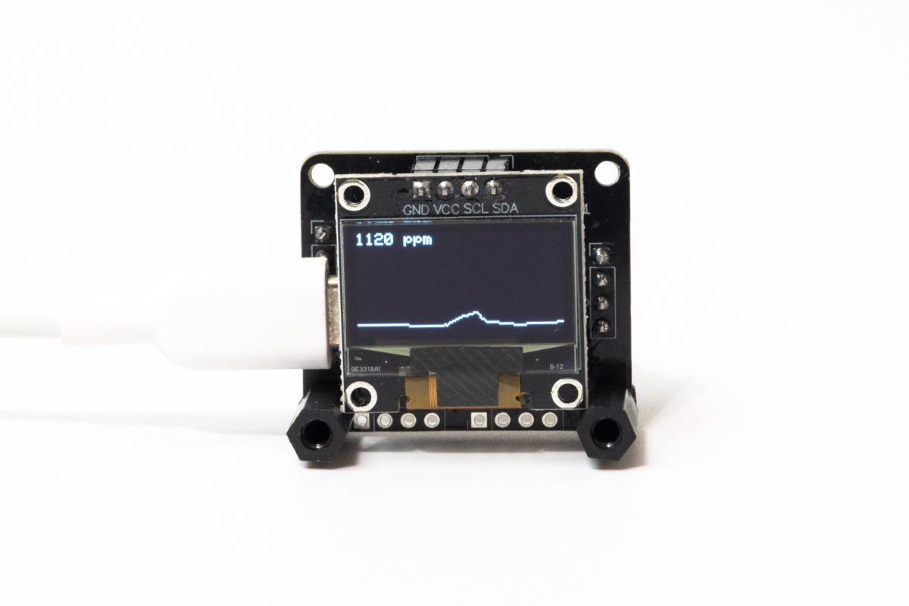
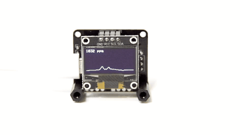

---

CO2 monitor made with RP2040.

## Devices

- RP2040 development board
- SSD1306 OLED display
- MH-Z19B CO2 sensor

## Schematic

See [RPCM-2111.pdf](pcb/RPCM-2111/RPCM-2111.pdf).

## Build guide

See [build guide](./docs/build_guide_en.md)（[日本語](./docs/build_guide_jp.md)）.

## License

MIT License

## Author

[toms74209200](<https://github.com/toms74209200>)

