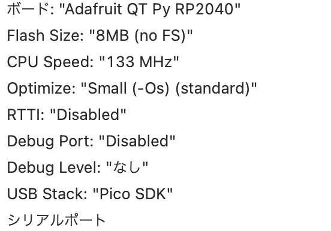

# PR2040 CO2 モニタ ビルド ガイド

## 組み立て

## 環境構築

このプロジェクトでは C/C++ とArduino IDE を用いて開発を行います. 本項ではこれらを用いてデバイスの開発環境の構築を行います.

### C/C++ 開発環境の構築

#### Arduino IDE を使う

**Arduino IDE のインストール**

Arduino IDE をインストール.

[Software | Arduino](https://www.arduino.cc/en/software)

macOS では Homebrew を使ってインストールできます.

```bash
$ brew install --cask arduino
```

**ボードライブラリの追加**

1. メニューで「ファイル」>「環境設定」を選択し, 「追加のボードマネージャのURL」に以下のURLを追加します.

```
https://github.com/earlephilhower/arduino-pico/releases/download/global/package_rp2040_index.json
```

2. メニューから「ツール」>「ボード」>「ボードマネージャ...」を選択し「ボードマネージャ」を開き,  `Raspberry Pi Pico/RP2040` を検索しインストールします

**ライブラリの追加**

メニューで「スケッチ」>「ライブラリをインクルード」>「ライブラリを管理…」を選択し「ライブラリマネージャ」を開きます. 「ライブラリマネージャ」で `Adafruit_SSD1306` と `Adafruit_GFX` を検索しインストールします.

**ボードの設定**

ファームウェアを書き込む前に対象となる端末の設定を行います. メニューの「ツール」にある項目を以下のように設定してください. ただしシリアルポートはファームウェア書き込み後シリアルポートを有効にしなければ選択できません. デバッグ実行をする場合は「Optimize」, 「RTTI」, 「Debug Port」を適宜指定します.

| 項             | 値                     |
| -------------- | ---------------------- |
| ボード         | Adafruit QT Py RP2040  |
| Flash Size     | 8MB (no FS)            |
| CPU Speed      | 133 MHz                |
| Optimize       | Small (-Os) (standard) |
| RTTI           | Disabled               |
| Debug Port     | Disabled               |
| Debug Level    | なし                   |
| USB Stack      | Pico SDK               |
| シリアルポート | N/A（選択不可）        |



**書き込み方法**

「BOOT」スイッチを押しながらUSBに接続します. 「デバイスマネージャ(Windows)」「システム情報(macOS)」で「RP2 Boot」が接続していることを確認してください. 

メニューで「ファイル」>「スケッチ例」>「rp2040」>「Temperature」を選択.

メニューの「ツール」>「シリアルポート」には表示されません. そのまま書き込み, 書き込みに成功するとUSBの接続が切れシリアルポートとして認識されます.

---

開発基板(Tiny 2040)の詳細は公式サイトを確認ください.

[Tiny 2040 – Pimoroni](https://shop.pimoroni.com/products/tiny-2040)  
https://shop.pimoroni.com/products/tiny-2040


[Tiny 2040 chematic](https://cdn.shopify.com/s/files/1/0174/1800/files/Tiny2040_PIM558_schematic.pdf)  
https://cdn.shopify.com/s/files/1/0174/1800/files/Tiny2040_PIM558_schematic.pdf

**参考**

- [earlephilhower/arduino-pico: Raspberry Pi Pico Arduino core, for all RP2040 boards](https://github.com/earlephilhower/arduino-pico)

- [Arduino IDEでRaspberry Pi Picoの開発環境を構築 | TomoSoft](https://tomosoft.jp/design/?p=43370)

