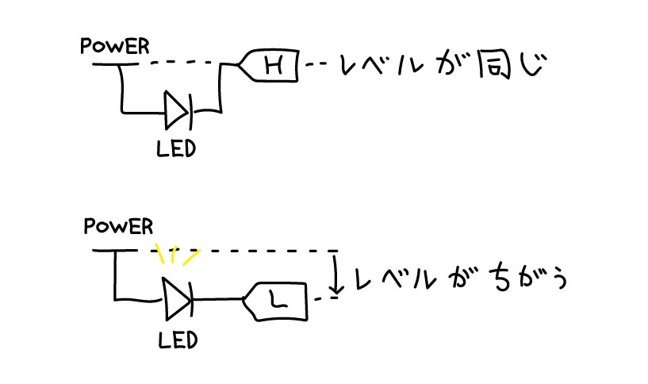
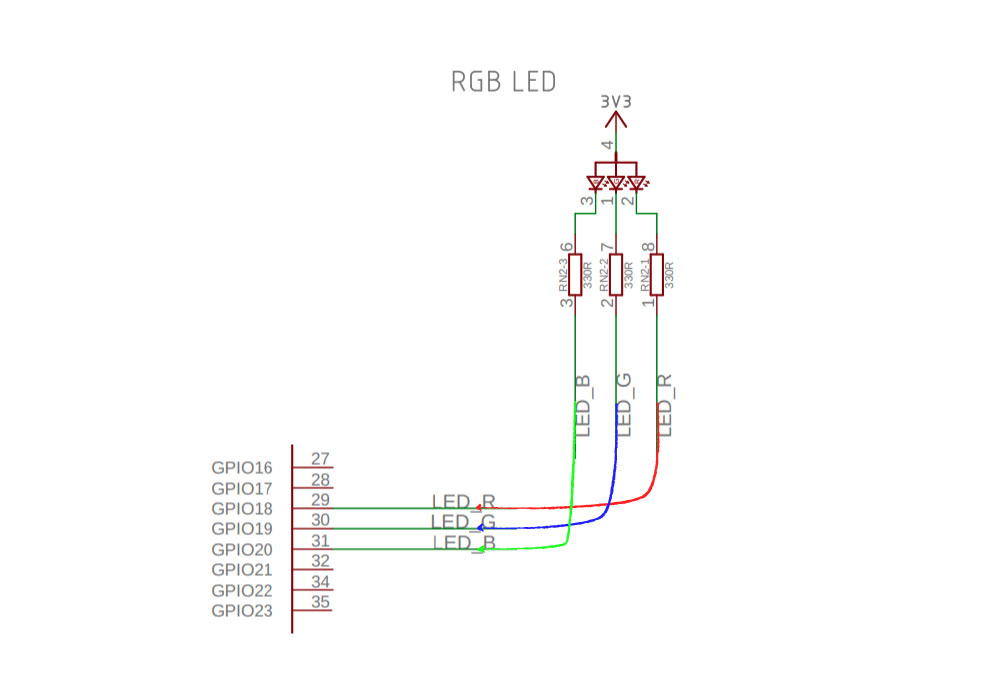

## Chapt. 1 Hello World

まずはマイコンの基本的な周辺機能を用いてファームウェアによるデバイスの操作方法を学びます.

### 1-1 Lチカ すべての始まり

マイコンの外部インタフェースとしてもっとも簡単なGPIOピンの操作を行い, LEDを点灯させます.

LEDの片側は電源に繋がっており, もう一方がGPIOピンに繋がっています. GPIOピンは `HIGH` と `LOW` の2値を取ることができ[[1](#arduino_constants)], 値を変更することでLEDの点灯を制御します.

ここで使用するマイコン(Tiny 2040) には3色LEDが実装されています. R, G, B の各色に対応するGPIOを制御することでLEDを点灯させることができます.

#### Advanced

- LEDの明るさを変更するには?

#### Refs.

[1]<a name="arduino_constants"/> [Defining Pin Levels: HIGH and LOW | constants - Arduino Reference](https://www.arduino.cc/reference/en/language/variables/constants/constants/#_defining_pin_levels_high_and_low)