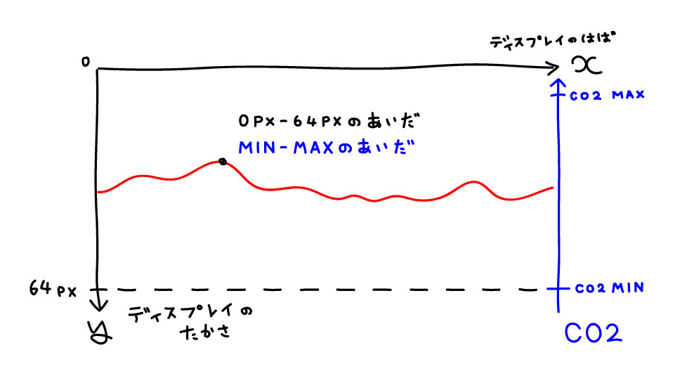

## Chapt. 3 CO2 モニタを作る

これまで使ってきた機能を組み合わせてCO2モニタを作成します. 

### 3-2 グラフを表示する

ここではCO2の値を直接表示するだけでなく, 値をグラフとして描画します. グラフの描画にはライブラリの図形描画機能[[1](#adafruit_graphics)] を使います. 

まずは簡単のために, 1点を描画することを考えます. ある 1点を描画するには横方向の位置と縦方向の位置が必要です. 横方向の位置は画面の横幅を次々与えるだけです. 縦方向の位置はCO2の値と画面の縦の長さから計算する必要があります. つまり画面の上端と下端がそれぞれCO2の値の最大値と最小値となるように計算します. 

CO2濃度は屋外で 400ppm前後でありこれが最低値です. またMH-Z19Bでは 5000ppmまで測定することができますが, 一般的に 3000ppmを超えることはまれです. また厚生労働省では屋内のCO2濃度を 1000ppm以下に維持するよう奨励しています[[3](#mhlw_go)].

### Refs.

[1]<a name="adafruit_graphics"> [Graphics Primitives | Adafruit GFX Graphics Library | Adafruit Learning System](https://learn.adafruit.com/adafruit-gfx-graphics-library/graphics-primitives)

[2]<a name="kisho_co2"> [気象庁 | 二酸化炭素濃度の経年変化](https://ds.data.jma.go.jp/ghg/kanshi/ghgp/co2_trend.html)

[3]<a name="mhlw_go"> [「換気の悪い密閉空間」を改善するための換気の方法（リーフレット）（令和2年4月3日改訂）［PDF形式：278KB］](https://www.mhlw.go.jp/content/10900000/000618969.pdf)

